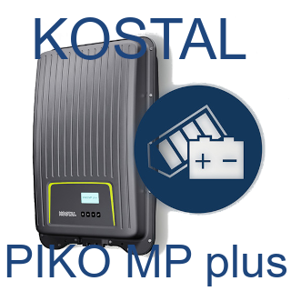
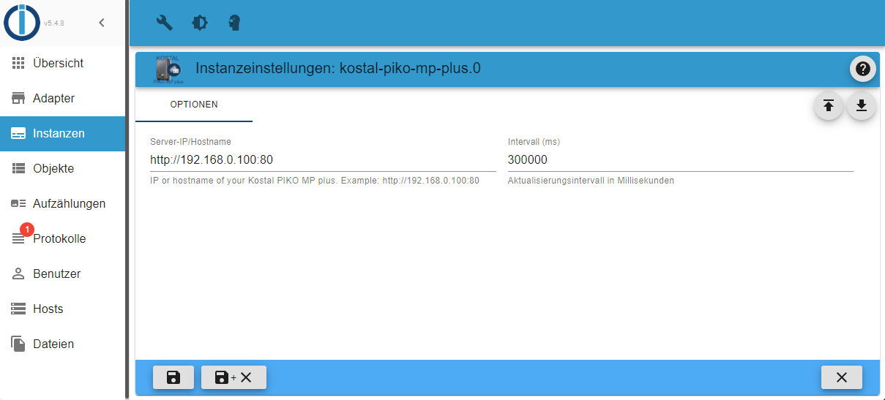

# ioBroker.kostal-piko-mp-plus

## Konfiguration

1. Erstelle eine neue Instanz des Adapter
2. Trage die IP/Hostname in das "Server IP/Hostname" Feld mit http Protokol und Port ein, wenn nötig.
3. Ändere den Interval, wenn du möchtest (Standard: alle 5 Minuten)
4. Speicher die Einstellungen

Warte einige Sekunden bis der Adapter die Daten das erste Mal abgerufen hat.

### Beispiel

