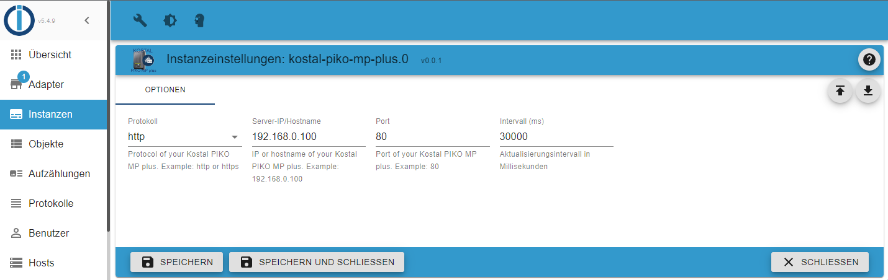

# ioBroker.kostal-piko-mp-plus

## Konfiguration

1. Erstelle eine neue Instanz des Adapter.
2. Wähle im Feld "Protokoll" das richtige HTTP Protokoll aus.
3. Trage die IP oder Hostname in das "Server IP/Hostname" Feld ein.
4. Trage die Port Nummer im Feld "Port" ein. (Standard Ports: http = 80 , https = 443)
5. Bei Bedarf kann der Aktualisierungsintervall geändert, im Feld "Intervall (ms)" werden. (Standard: alle 5 Minuten)
6. Speicher die Einstellungen.

Warte einige Sekunden bis der Adapter die Daten das erste Mal abgerufen hat.

### Beispiel

