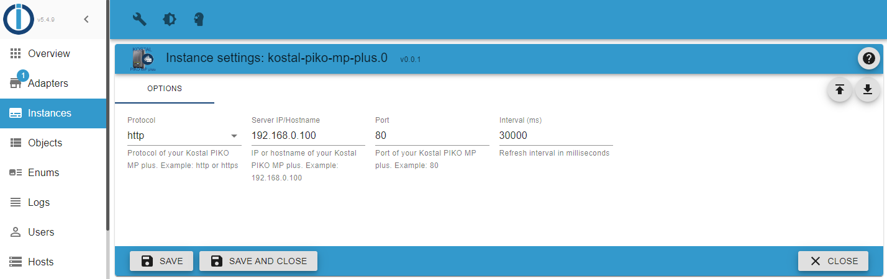

# ioBroker.kostal-piko-mp-plus

## Configuration

1. Create a new instance of the adapter
2. Type the IP/Hostname in the "Server IP/Hostname" input field with http protocol and port if necessary.
3. Change the interval Time if you want (default: every 5 min)
4. Save the settings

Wait some seconds until the adapter collects the data for the first time.

### Example

