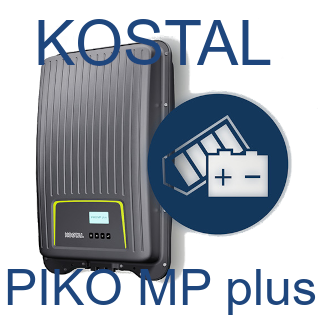

# ioBroker.kostal-piko-mp-plus

## Configuration

1. Create a new instance of the adapter. 2.
2. Select the correct HTTP protocol in the "Protocol" field. 3.
3. Enter the IP or hostname in the "Server IP/Hostname" field. 4.
4. Enter the port number in the "Port" field. (Default ports: http = 80 , https = 443)
5. If necessary, you can change the update interval in the "Interval (ms)" field. (Default: every 5 minutes)
6. Save the settings.

Wait a few seconds until the adapter has retrieved the data for the first time.

Wait some seconds until the adapter collects the data for the first time.

### Example

